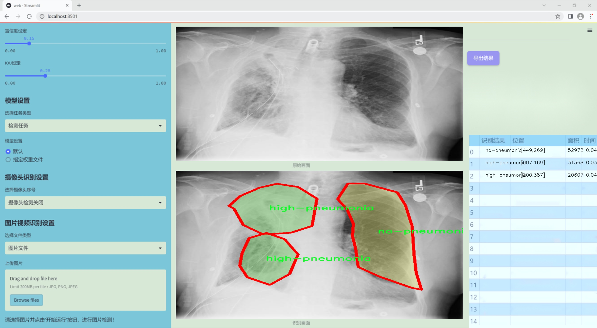
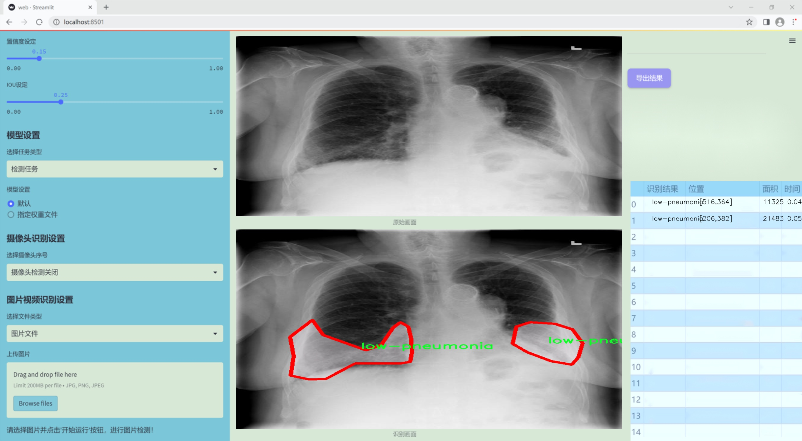
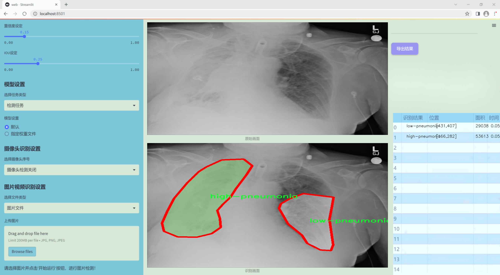
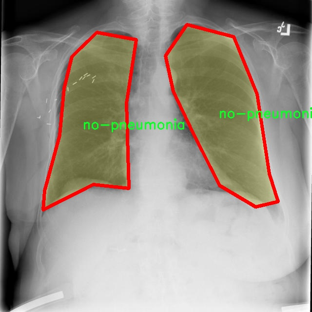
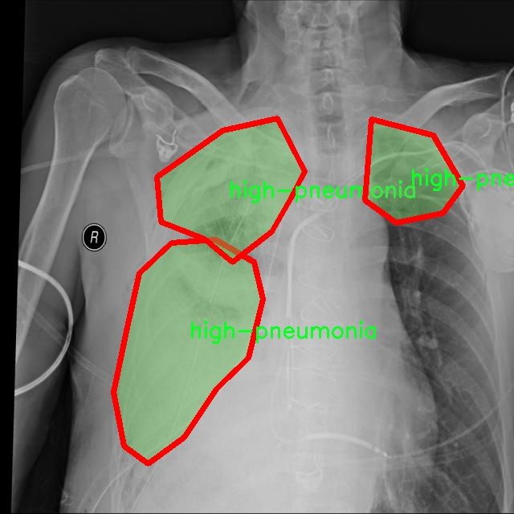
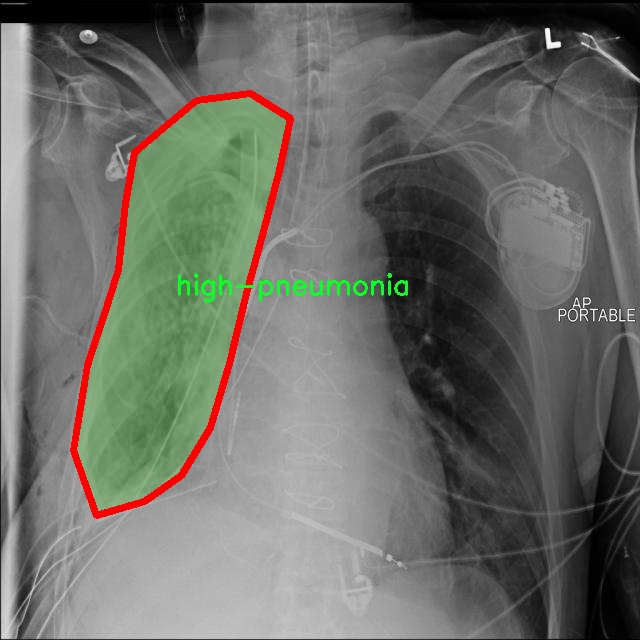
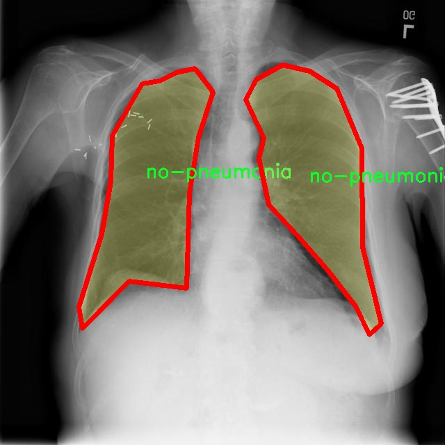
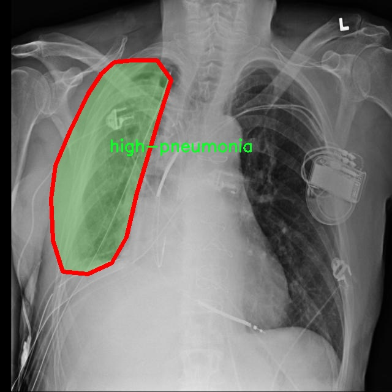

### 1.背景意义

研究背景与意义

肺炎作为一种常见的呼吸系统疾病，严重影响了全球范围内的公共健康。根据世界卫生组织的统计，肺炎每年导致数百万人的死亡，尤其是在儿童和老年人群体中。传统的肺炎诊断方法依赖于医生的临床经验和影像学检查，这不仅耗时且容易受到主观因素的影响。因此，开发一种高效、准确的肺炎类型检测系统显得尤为重要。

近年来，深度学习技术在医学影像分析领域取得了显著进展，尤其是目标检测和实例分割等任务。YOLO（You Only Look Once）系列模型因其快速的推理速度和较高的检测精度，成为了计算机视觉领域的热门选择。随着YOLOv11的推出，其在处理复杂场景和多类别目标检测方面的能力进一步增强，为肺炎类型的自动检测提供了新的可能性。本研究旨在基于改进的YOLOv11模型，构建一个肺炎类型检测系统，能够准确识别高肺炎、低肺炎和无肺炎三种类别。

本项目所使用的数据集包含9200幅胸部影像，涵盖了三种肺炎类型的标注信息。这一数据集的丰富性和多样性为模型的训练和验证提供了坚实的基础。通过对这些影像进行实例分割，系统能够在不同的肺炎类型中进行更精细的区分，从而提高诊断的准确性和可靠性。此外，改进的YOLOv11模型在处理速度上的优势，将有助于在临床环境中实现实时检测，进而提高医疗服务的效率。

综上所述，基于改进YOLOv11的肺炎类型检测系统不仅具有重要的学术价值，也为实际医疗应用提供了新的解决方案。通过提升肺炎的早期诊断能力，有望降低疾病的死亡率，改善患者的生活质量，进而为公共健康做出积极贡献。

### 2.视频效果

[2.1 视频效果](https://www.bilibili.com/video/BV1P5qGYkEap/)

### 3.图片效果







##### [项目涉及的源码数据来源链接](https://kdocs.cn/l/cszuIiCKVNis)**

注意：本项目提供训练的数据集和训练教程,由于版本持续更新,暂不提供权重文件（best.pt）,请按照6.训练教程进行训练后实现上图演示的效果。

### 4.数据集信息

##### 4.1 本项目数据集类别数＆类别名

nc: 3
names: ['high-pneumonia', 'low-pneumonia', 'no-pneumonia']


该项目为【图像分割】数据集，请在【训练教程和Web端加载模型教程（第三步）】这一步的时候按照【图像分割】部分的教程来训练

##### 4.2 本项目数据集信息介绍

本项目数据集信息介绍

本项目所使用的数据集专注于胸部影像学（chest imaging），旨在为改进YOLOv11的肺炎类型检测系统提供高质量的训练样本。该数据集包含三种主要类别，分别是“高肺炎”（high-pneumonia）、“低肺炎”（low-pneumonia）和“无肺炎”（no-pneumonia），总类别数量为三。这一分类设计旨在帮助模型更好地识别和区分不同类型的肺炎，从而提高其在临床应用中的准确性和可靠性。

在数据集的构建过程中，特别注重样本的多样性和代表性，以确保模型能够适应不同患者的影像特征。每个类别的样本均来自真实的临床病例，涵盖了不同年龄段、性别及病程的患者。这种多样性不仅有助于提高模型的泛化能力，还能有效降低过拟合的风险。此外，数据集中的影像数据经过严格的标注和审核，确保每一张图像都准确反映其对应的肺炎类型。

通过使用这一数据集，改进后的YOLOv11模型将能够在实时检测中迅速识别出肺炎的类型，为医生提供有力的辅助决策支持。数据集的设计与构建充分考虑了实际应用中的需求，力求在保证检测精度的同时，提升处理速度，以满足临床环境中对快速诊断的迫切需求。总之，本项目的数据集不仅为模型训练提供了坚实的基础，也为肺炎的早期检测和干预提供了重要的数据支持。











### 5.全套项目环境部署视频教程（零基础手把手教学）

[5.1 所需软件PyCharm和Anaconda安装教程（第一步）](https://www.bilibili.com/video/BV1BoC1YCEKi/?spm_id_from=333.999.0.0&vd_source=bc9aec86d164b67a7004b996143742dc)


[5.2 安装Python虚拟环境创建和依赖库安装视频教程（第二步）](https://www.bilibili.com/video/BV1ZoC1YCEBw?spm_id_from=333.788.videopod.sections&vd_source=bc9aec86d164b67a7004b996143742dc)

### 6.改进YOLOv11训练教程和Web_UI前端加载模型教程（零基础手把手教学）

[6.1 改进YOLOv11训练教程和Web_UI前端加载模型教程（第三步）](https://www.bilibili.com/video/BV1BoC1YCEhR?spm_id_from=333.788.videopod.sections&vd_source=bc9aec86d164b67a7004b996143742dc)


按照上面的训练视频教程链接加载项目提供的数据集，运行train.py即可开始训练



     Epoch   gpu_mem       box       obj       cls    labels  img_size
     1/200     20.8G   0.01576   0.01955  0.007536        22      1280: 100%|██████████| 849/849 [14:42<00:00,  1.04s/it]
               Class     Images     Labels          P          R     mAP@.5 mAP@.5:.95: 100%|██████████| 213/213 [01:14<00:00,  2.87it/s]
                 all       3395      17314      0.994      0.957      0.0957      0.0843

     Epoch   gpu_mem       box       obj       cls    labels  img_size
     2/200     20.8G   0.01578   0.01923  0.007006        22      1280: 100%|██████████| 849/849 [14:44<00:00,  1.04s/it]
               Class     Images     Labels          P          R     mAP@.5 mAP@.5:.95: 100%|██████████| 213/213 [01:12<00:00,  2.95it/s]
                 all       3395      17314      0.996      0.956      0.0957      0.0845

     Epoch   gpu_mem       box       obj       cls    labels  img_size
     3/200     20.8G   0.01561    0.0191  0.006895        27      1280: 100%|██████████| 849/849 [10:56<00:00,  1.29it/s]
               Class     Images     Labels          P          R     mAP@.5 mAP@.5:.95: 100%|███████   | 187/213 [00:52<00:00,  4.04it/s]
                 all       3395      17314      0.996      0.957      0.0957      0.0845


###### [项目数据集下载链接](https://kdocs.cn/l/cszuIiCKVNis)

### 7.原始YOLOv11算法讲解

YOLOv11是Ultralytics推出的YOLO系列最新版本，专为实现尖端的物体检测而设计。其架构和训练方法上进行了重大改进，使之不仅具备卓越的准确性和处理速度，还在计算效率上实现了一场革命。得益于其改进的主干和颈部架构，YOLOv11在特征提取和处理复杂任务时表现更加出色。在2024年9月27日，Ultralytics通过长达九小时的在线直播发布这一新作，展示了其在计算机视觉领域的革新。

YOLOv11通过精细的架构设计和优化训练流程，在保持高精度的同时，缩减了参数量，与YOLOv8m相比减少了22%的参数，使其在COCO数据集上的平均准确度（mAP）有所提升。这种效率的提高使YOLOv11非常适合部署在各种硬件环境中，包括边缘设备、云计算平台以及支持NVIDIA GPU的系统，确保在灵活性上的优势。

该模型支持广泛的任务，从对象检测、实例分割到图像分类、姿态估计和定向对象检测（OBB），几乎覆盖了计算机视觉的所有主要挑战。其创新的C3k2和C2PSA模块提升了网络深度和注意力机制的应用，提高了特征提取的效率和效果。同时，YOLOv11的改进网络结构也使之在复杂视觉任务上得以从容应对，成为各类计算机视觉任务的多功能选择。这些特性令YOLOv11在实施实时物体检测的各个领域中表现出众。
* * *

2024年9月27日，Ultralytics在线直播长达九小时，为YOLO11召开“发布会”

YOLO11 是 Ultralytics YOLO 系列实时物体检测器的最新版本，它以尖端的准确性、速度和效率重新定义了可能性。在之前 YOLO
版本的显著进步的基础上，YOLO11 在架构和训练方法方面进行了重大改进，使其成为各种计算机视觉任务的多功能选择。


##### YOLO11主要特点：

  * 增强的特征提取：YOLO11 采用了改进的主干和颈部架构，增强了特征提取能力，可实现更精确的对象检测和复杂任务性能。
  * 针对效率和速度进行了优化：YOLO11 引入了完善的架构设计和优化的训练流程，可提供更快的处理速度，并在准确度和性能之间保持最佳平衡。
  * 更少的参数，更高的准确度：借助模型设计的进步，YOLO11m 在 COCO 数据集上实现了更高的平均准确度 (mAP)，同时使用的参数比 YOLOv8m 少 22%，从而提高了计算效率，同时又不影响准确度。
  * 跨环境的适应性：YOLO11 可以无缝部署在各种环境中，包括边缘设备、云平台和支持 NVIDIA GPU 的系统，从而确保最大的灵活性。
  * 支持的任务范围广泛：无论是对象检测、实例分割、图像分类、姿势估计还是定向对象检测 (OBB)，YOLO11 都旨在满足各种计算机视觉挑战。

##### 支持的任务和模式

YOLO11 以 YOLOv8 中引入的多功能模型系列为基础，为各种计算机视觉任务提供增强的支持：

Model| Filenames| Task| Inference| Validation| Training| Export  
---|---|---|---|---|---|---  
YOLO11| yolol11n.pt, yolol11s.pt, yolol11m.pt, yolol11x.pt| Detection| ✅| ✅|
✅| ✅  
YOLO11-seg| yolol11n-seg.pt, yolol11s-seg.pt, yolol11m-seg.pt,
yolol11x-seg.pt| Instance Segmentation| ✅| ✅| ✅| ✅  
YOLO11-pose| yolol11n-pose.pt, yolol11s-pose.pt, yolol11m-pose.pt,
yolol11x-pose.pt| Pose/Keypoints| ✅| ✅| ✅| ✅  
YOLO11-obb| yolol11n-obb.pt, yolol11s-obb.pt, yolol11m-obb.pt,
yolol11x-obb.pt| Oriented Detection| ✅| ✅| ✅| ✅  
YOLO11-cls| yolol11n-cls.pt, yolol11s-cls.pt, yolol11m-cls.pt,
yolol11x-cls.pt| Classification| ✅| ✅| ✅| ✅  
  
##### 简单的 YOLO11 训练和推理示例

以下示例适用于用于对象检测的 YOLO11 Detect 模型。

    
    
    from ultralytics import YOLO
    
    # Load a model
    model = YOLO("yolo11n.pt")
    
    # Train the model
    train_results = model.train(
        data="coco8.yaml",  # path to dataset YAML
        epochs=100,  # number of training epochs
        imgsz=640,  # training image size
        device="cpu",  # device to run on, i.e. device=0 or device=0,1,2,3 or device=cpu
    )
    
    # Evaluate model performance on the validation set
    metrics = model.val()
    
    # Perform object detection on an image
    results = model("path/to/image.jpg")
    results[0].show()
    
    # Export the model to ONNX format
    path = model.export(format="onnx")  # return path to exported model

##### 支持部署于边缘设备

YOLO11 专为适应各种环境而设计，包括边缘设备。其优化的架构和高效的处理能力使其适合部署在边缘设备、云平台和支持 NVIDIA GPU
的系统上。这种灵活性确保 YOLO11 可用于各种应用，从移动设备上的实时检测到云环境中的复杂分割任务。有关部署选项的更多详细信息，请参阅导出文档。

##### YOLOv11 yaml文件

    
    
    # Ultralytics YOLO 🚀, AGPL-3.0 license
    # YOLO11 object detection model with P3-P5 outputs. For Usage examples see https://docs.ultralytics.com/tasks/detect
    
    # Parameters
    nc: 80 # number of classes
    scales: # model compound scaling constants, i.e. 'model=yolo11n.yaml' will call yolo11.yaml with scale 'n'
      # [depth, width, max_channels]
      n: [0.50, 0.25, 1024] # summary: 319 layers, 2624080 parameters, 2624064 gradients, 6.6 GFLOPs
      s: [0.50, 0.50, 1024] # summary: 319 layers, 9458752 parameters, 9458736 gradients, 21.7 GFLOPs
      m: [0.50, 1.00, 512] # summary: 409 layers, 20114688 parameters, 20114672 gradients, 68.5 GFLOPs
      l: [1.00, 1.00, 512] # summary: 631 layers, 25372160 parameters, 25372144 gradients, 87.6 GFLOPs
      x: [1.00, 1.50, 512] # summary: 631 layers, 56966176 parameters, 56966160 gradients, 196.0 GFLOPs
    
    # YOLO11n backbone
    backbone:
      # [from, repeats, module, args]
      - [-1, 1, Conv, [64, 3, 2]] # 0-P1/2
      - [-1, 1, Conv, [128, 3, 2]] # 1-P2/4
      - [-1, 2, C3k2, [256, False, 0.25]]
      - [-1, 1, Conv, [256, 3, 2]] # 3-P3/8
      - [-1, 2, C3k2, [512, False, 0.25]]
      - [-1, 1, Conv, [512, 3, 2]] # 5-P4/16
      - [-1, 2, C3k2, [512, True]]
      - [-1, 1, Conv, [1024, 3, 2]] # 7-P5/32
      - [-1, 2, C3k2, [1024, True]]
      - [-1, 1, SPPF, [1024, 5]] # 9
      - [-1, 2, C2PSA, [1024]] # 10
    
    # YOLO11n head
    head:
      - [-1, 1, nn.Upsample, [None, 2, "nearest"]]
      - [[-1, 6], 1, Concat, [1]] # cat backbone P4
      - [-1, 2, C3k2, [512, False]] # 13
    
      - [-1, 1, nn.Upsample, [None, 2, "nearest"]]
      - [[-1, 4], 1, Concat, [1]] # cat backbone P3
      - [-1, 2, C3k2, [256, False]] # 16 (P3/8-small)
    
      - [-1, 1, Conv, [256, 3, 2]]
      - [[-1, 13], 1, Concat, [1]] # cat head P4
      - [-1, 2, C3k2, [512, False]] # 19 (P4/16-medium)
    
      - [-1, 1, Conv, [512, 3, 2]]
      - [[-1, 10], 1, Concat, [1]] # cat head P5
      - [-1, 2, C3k2, [1024, True]] # 22 (P5/32-large)
    
      - [[16, 19, 22], 1, Detect, [nc]] # Detect(P3, P4, P5)
    

**YOLO11和YOLOv8 yaml文件的区别**


##### 改进模块代码

  * C3k2 

    
    
    class C3k2(C2f):
        """Faster Implementation of CSP Bottleneck with 2 convolutions."""
    
        def __init__(self, c1, c2, n=1, c3k=False, e=0.5, g=1, shortcut=True):
            """Initializes the C3k2 module, a faster CSP Bottleneck with 2 convolutions and optional C3k blocks."""
            super().__init__(c1, c2, n, shortcut, g, e)
            self.m = nn.ModuleList(
                C3k(self.c, self.c, 2, shortcut, g) if c3k else Bottleneck(self.c, self.c, shortcut, g) for _ in range(n)
            )

C3k2，它是具有两个卷积的CSP（Partial Cross Stage）瓶颈架构的更快实现。

**类继承：**

  * `C3k2`继承自类`C2f`。这表明`C2f`很可能实现了经过修改的基本CSP结构，而`C3k2`进一步优化或修改了此结构。

**构造函数（`__init__`）：**

  * `c1`：输入通道。

  * `c2`：输出通道。

  * `n`：瓶颈层数（默认为1）。

  * `c3k`：一个布尔标志，确定是否使用`C3k`块或常规`Bottleneck`块。

  * `e`：扩展比率，控制隐藏层的宽度（默认为0.5）。

  * `g`：分组卷积的组归一化参数或组数（默认值为 1）。

  * `shortcut`：一个布尔值，用于确定是否在网络中包含快捷方式连接（默认值为 `True`）。

**初始化：**

  * `super().__init__(c1, c2, n, short-cut, g, e)` 调用父类 `C2f` 的构造函数，初始化标准 CSP 组件，如通道数、快捷方式、组等。

**模块列表（`self.m`）：**

  * `nn.ModuleList` 存储 `C3k` 或 `Bottleneck` 模块，具体取决于 `c3k` 的值。

  * 如果 `c3k` 为 `True`，它会初始化 `C3k` 模块。`C3k` 模块接收以下参数：

  * `self.c`：通道数（源自 `C2f`）。

  * `2`：这表示在 `C3k` 块内使用了两个卷积层。

  * `shortcut` 和 `g`：从 `C3k2` 构造函数传递。

  * 如果 `c3k` 为 `False`，则初始化标准 `Bottleneck` 模块。

`for _ in range(n)` 表示将创建 `n` 个这样的块。

**总结：**

  * `C3k2` 实现了 CSP 瓶颈架构，可以选择使用自定义 `C3k` 块（具有两个卷积）或标准 `Bottleneck` 块，具体取决于 `c3k` 标志。

  * C2PSA

    
    
    class C2PSA(nn.Module):
        """
        C2PSA module with attention mechanism for enhanced feature extraction and processing.
    
        This module implements a convolutional block with attention mechanisms to enhance feature extraction and processing
        capabilities. It includes a series of PSABlock modules for self-attention and feed-forward operations.
    
        Attributes:
            c (int): Number of hidden channels.
            cv1 (Conv): 1x1 convolution layer to reduce the number of input channels to 2*c.
            cv2 (Conv): 1x1 convolution layer to reduce the number of output channels to c.
            m (nn.Sequential): Sequential container of PSABlock modules for attention and feed-forward operations.
    
        Methods:
            forward: Performs a forward pass through the C2PSA module, applying attention and feed-forward operations.
    
        Notes:
            This module essentially is the same as PSA module, but refactored to allow stacking more PSABlock modules.
    
        Examples:
            >>> c2psa = C2PSA(c1=256, c2=256, n=3, e=0.5)
            >>> input_tensor = torch.randn(1, 256, 64, 64)
            >>> output_tensor = c2psa(input_tensor)
        """
    
        def __init__(self, c1, c2, n=1, e=0.5):
            """Initializes the C2PSA module with specified input/output channels, number of layers, and expansion ratio."""
            super().__init__()
            assert c1 == c2
            self.c = int(c1 * e)
            self.cv1 = Conv(c1, 2 * self.c, 1, 1)
            self.cv2 = Conv(2 * self.c, c1, 1)
    
            self.m = nn.Sequential(*(PSABlock(self.c, attn_ratio=0.5, num_heads=self.c // 64) for _ in range(n)))
    
        def forward(self, x):
            """Processes the input tensor 'x' through a series of PSA blocks and returns the transformed tensor."""
            a, b = self.cv1(x).split((self.c, self.c), dim=1)
            b = self.m(b)
            return self.cv2(torch.cat((a, b), 1))

`C2PSA` 模块是一个自定义神经网络层，带有注意力机制，用于增强特征提取和处理。

**类概述**

  * **目的：**

  * `C2PSA` 模块引入了一个卷积块，利用注意力机制来改进特征提取和处理。

  * 它使用一系列 `PSABlock` 模块，这些模块可能代表某种形式的位置自注意力 (PSA)，并且该架构旨在允许堆叠多个 `PSABlock` 层。

**构造函数（`__init__`）：**

  * **参数：**

  * `c1`：输入通道（必须等于 `c2`）。

  * `c2`：输出通道（必须等于 `c1`）。

  * `n`：要堆叠的 `PSABlock` 模块数量（默认值为 1）。

  * `e`：扩展比率，用于计算隐藏通道的数量（默认值为 0.5）。

  * **属性：**

  * `self.c`：隐藏通道数，计算为 `int(c1 * e)`。

  * `self.cv1`：一个 `1x1` 卷积，将输入通道数从 `c1` 减少到 `2 * self.c`。这为将输入分成两部分做好准备。

  * `self.cv2`：另一个 `1x1` 卷积，处理后将通道维度恢复回 `c1`。

  * `self.m`：一系列 `PSABlock` 模块。每个 `PSABlock` 接收 `self.c` 通道，注意头的数量为 `self.c // 64`。每个块应用注意和前馈操作。

**前向方法：**

  * **输入：**

  * `x`，输入张量。

  * **操作：**

  1. `self.cv1(x)` 应用 `1x1` 卷积，将输入通道大小从 `c1` 减小到 `2 * self.c`。

  2. 生成的张量沿通道维度分为两部分，`a` 和 `b`。

  * `a`：第一个 `self.c` 通道。

  * `b`：剩余的 `self.c` 通道。

  1. `b` 通过顺序容器 `self.m`，它是 `PSABlock` 模块的堆栈。这部分经过基于注意的处理。

  2. 处理后的张量 `b` 与 `a` 连接。

  3. `self.cv2` 应用 `1x1` 卷积，将通道大小恢复为 `c1`。

  * **输出：**

  * 应用注意和卷积操作后的变换后的张量。

**总结：**

  * **C2PSA** 是一个增强型卷积模块，它通过堆叠的 `PSABlock` 模块应用位置自注意力。它拆分输入张量，将注意力应用于其中一部分，然后重新组合并通过最终卷积对其进行处理。此结构有助于从输入数据中提取复杂特征。

##### 网络结构


### 8.200+种全套改进YOLOV11创新点原理讲解

#### 8.1 200+种全套改进YOLOV11创新点原理讲解大全

由于篇幅限制，每个创新点的具体原理讲解就不全部展开，具体见下列网址中的改进模块对应项目的技术原理博客网址【Blog】（创新点均为模块化搭建，原理适配YOLOv5~YOLOv11等各种版本）

[改进模块技术原理博客【Blog】网址链接](https://gitee.com/qunmasj/good)


#### 8.2 精选部分改进YOLOV11创新点原理讲解

###### 这里节选部分改进创新点展开原理讲解(完整的改进原理见上图和[改进模块技术原理博客链接](https://gitee.com/qunmasj/good)【如果此小节的图加载失败可以通过CSDN或者Github搜索该博客的标题访问原始博客，原始博客图片显示正常】
### 可变性卷积DCN简介
卷积神经网络由于其构建模块中固定的几何结构，本质上受限于模型几何变换。为了提高卷积神经网络的转换建模能力，《Deformable Convolutional Networks》作者提出了两个模块：可变形卷积（deformable convolution）和可变形RoI池（deformable RoI pooling）。这两个模块均基于用额外的偏移来增加模块中的空间采样位置以及从目标任务中学习偏移的思想，而不需要额外的监督。

第一次证明了在深度神经网络中学习密集空间变换（dense spatial transformation）对于复杂的视觉任务是有效的

视觉识别中的一个关键挑战是如何适应对象比例、姿态、视点和零件变形中的几何变化或模型几何变换。一般有两种方法实现：
1）建立具有足够期望变化的训练数据集。这通常通过增加现有的数据样本来实现，例如通过仿射变换。但是训练成本昂贵而且模型参数庞大。
2）使用变换不变（transformation-invariant）的特征和算法。比如比较有名的SIFT(尺度不变特征变换)便是这一类的代表算法。

但以上的方法有两个缺点：
1）几何变换被假定为固定的和已知的，这些先验知识被用来扩充数据，设计特征和算法。为此，这个假设阻止了对具有未知几何变换的新任务的推广，从而导致这些几何变换可能没有被正确建模。
2）对于不变特征和算法进行手动设计，对于过于复杂的变换可能是困难的或不可行的。

卷积神经网络本质上局限于模拟大型未知转换。局限性源于CNN模块的固定几何结构：卷积单元在固定位置对输入特征图进行采样；池化层以固定比率降低特征矩阵分辨率；RoI（感兴趣区域）池化层将RoI分成固定的空间箱（spatial bins）等。缺乏处理几何变换的内部机制。

这种内部机制的缺乏会导致一些问题，举个例子。同一个CNN层中所有激活单元的感受野大小是相同的，但是这是不可取的。因为不同的位置可能对应于具有不同尺度或变形的对象，所以尺度或感受野大小的自适应确定对于具有精细定位的视觉识别是渴望的。

对于这些问题，作者提出了两个模块提高CNNs对几何变换建模的能力。


deformable convolution（可变形卷积）
将2D偏移量添加到标准卷积中的常规网格采样位置，使得采样网格能够自由变形。通过额外的卷积层，从前面的特征映射中学习偏移。因此，变形采用局部、密集和自适应的方式取决于输入特征。


deformable RoI pooling（可变形RoI池化）
为先前RoI池化的常规库（bin）分区中的每个库位置（bin partition）增加了一个偏移量。类似地，偏移是从前面的特征图和感兴趣区域中学习的，从而能够对具有不同形状的对象进行自适应部件定位（adaptive part localization）。

#### Deformable Convolutional Networks
Deformable Convolution
2D卷积由两个步骤组成：
1）在输入特征图x xx上使用规则网格R RR进行采样。
2）把这些采样点乘不同权重w ww后相加。

网格R定义感受野大小和扩张程度，比如内核大小为3x3，扩张程度为1的网格R可以表示为：
R = { ( − 1 , − 1 ) , ( − 1 , 0 ) , … , ( 0 , 1 ) , ( 1 , 1 ) } R = \{(-1,-1),(-1,0),\dots,(0,1),(1,1)\}
R={(−1,−1),(−1,0),…,(0,1),(1,1)}

​
 一般为小数，使用双线性插值进行处理。（把小数坐标分解到相邻的四个整数坐标点来计算结果）


具体操作如图所示：


首先对输入特征层进行一个普通的3x3卷积处理得到偏移域（offset field）。偏移域特征图具有与输入特征图相同的空间分辨率，channels维度2N对应于N个2D（xy两个方向）偏移。其中的N是原输入特征图上所具有的N个channels，也就是输入输出channels保持不变，这里xy两个channels分别对输出特征图上的一个channels进行偏移。确定采样点后就通过与相对应的权重w点乘相加得到输出特征图上该点最终值。

前面也提到过，由于这里xy两个方向所训练出来的偏移量一般来说是一个小数，那么为了得到这个点所对应的数值，会采用双线性插值的方法，从最近的四个邻近坐标点中计算得到该偏移点的数值，公式如下：


具体推理过程见：双线性插值原理

#### Deformable RoI Poolingb
所有基于区域提议（RPN）的对象检测方法都使用RoI池话处理，将任意大小的输入矩形区域转换为固定大小的特征图。


 一般为小数，需要使用双线性插值进行处理。


具体操作如图所示：


当时看这个部分的时候觉得有些突兀，明明RoI池化会将特征层转化为固定尺寸的区域。其实，我个人觉得，这个部分与上述的可变性卷积操作是类似的。这里同样是使用了一个普通的RoI池化操作，进行一些列处理后得到了一个偏移域特征图，然后重新作用于原来的w × H w \times Hw×H的RoI。只不过这里不再是规律的逐行逐列对每个格子进行池化，而是对于格子进行偏移后再池化处理。

#### Postion﹣Sensitive RoI Pooling
除此之外，论文还提出一种PS RoI池化（Postion﹣Sensitive RoI Pooling）。不同于上述可变形RoI池化中的全连接过程，这里使用全卷积替换。

具体操作如图所示：


首先，对于原来的特征图来说，原本是将输入特征图上的RoI区域分成k × k k\times kk×k个bin。而在这里，则是将输入特征图进行卷积操作，分别得到一个channels为k 2 ( C + 1 ) k^{2}(C+1)k (C+1)的得分图（score maps）和一个channels为2 k 2 ( C + 1 ) 2k{2}(C+1)2k 2 (C+1)的偏移域（offset fields），这两个特征矩阵的宽高是与输入特征矩阵相同的。其中，得分图的channels中，k × k k \times kk×k分别表示的是每一个网格，C CC表示的检测对象的类别数目，1表示背景。而在偏移域中的2表示xy两个方向的偏移。
也就是说，在PS RoI池化中，对于RoI的每一个网格都独自占一个通道形成一层得分图，然后其对于的偏移量占两个通道。offset fields得到的偏移是归一化后的偏移，需要通过和deformable RoI pooling中一样的变换方式得到∆ p i j ∆p_{ij}∆p ij，然后对每层得分图进行偏移池化处理。最后处理完的结果就对应着最后输出的一个网格。所以其包含了位置信息。

原文论述为：


#### Understanding Deformable ConvNets
当可变形卷积叠加时，复合变形的效果是深远的。如图所示：


ps：a是标准卷积的固定感受野，b是可变形卷积的适应性感受野。

感受野和标准卷积中的采样位置在整个顶部特征图上是固定的(左)。在可变形卷积中，它们根据对象的比例和形状进行自适应调整(右)。


### 9.系统功能展示

图9.1.系统支持检测结果表格显示

  图9.2.系统支持置信度和IOU阈值手动调节

  图9.3.系统支持自定义加载权重文件best.pt(需要你通过步骤5中训练获得)

  图9.4.系统支持摄像头实时识别

  图9.5.系统支持图片识别

  图9.6.系统支持视频识别

  图9.7.系统支持识别结果文件自动保存

  图9.8.系统支持Excel导出检测结果数据


### 10. YOLOv11核心改进源码讲解

#### 10.1 ui.py

以下是经过精简和注释的核心代码：

```python
import sys
import subprocess

def run_script(script_path):
    """
    使用当前 Python 环境运行指定的脚本。

    Args:
        script_path (str): 要运行的脚本路径
    """
    # 获取当前 Python 解释器的路径
    python_path = sys.executable

    # 构建运行命令，使用 streamlit 运行指定的脚本
    command = f'"{python_path}" -m streamlit run "{script_path}"'

    # 执行命令，并检查返回状态
    result = subprocess.run(command, shell=True)
    if result.returncode != 0:
        print("脚本运行出错。")

# 主程序入口
if __name__ == "__main__":
    # 指定要运行的脚本路径
    script_path = "web.py"  # 这里直接指定脚本名，假设它在当前目录下

    # 调用函数运行脚本
    run_script(script_path)
```

### 代码分析与注释：

1. **导入模块**：
   - `sys`：用于访问与 Python 解释器相关的变量和函数。
   - `subprocess`：用于创建新进程、连接到它们的输入/输出/错误管道，并获得返回码。

2. **`run_script` 函数**：
   - **参数**：接收一个字符串参数 `script_path`，表示要运行的 Python 脚本的路径。
   - **功能**：构建并执行一个命令，以在当前 Python 环境中运行指定的脚本。
   - **获取 Python 解释器路径**：使用 `sys.executable` 获取当前 Python 解释器的完整路径。
   - **构建命令**：使用 f-string 格式化命令字符串，指定使用 `streamlit` 模块运行脚本。
   - **执行命令**：使用 `subprocess.run` 执行命令，并通过 `shell=True` 允许在 shell 中执行。
   - **错误处理**：检查命令的返回码，如果不为 0，打印错误信息。

3. **主程序入口**：
   - 使用 `if __name__ == "__main__":` 确保只有在直接运行该脚本时才会执行以下代码。
   - 指定要运行的脚本路径 `script_path`，在这里假设脚本 `web.py` 位于当前目录。
   - 调用 `run_script` 函数来执行指定的脚本。

这样，代码的核心功能得以保留，同时也增加了注释以便于理解。

这个文件是一个名为 `ui.py` 的 Python 脚本，主要功能是运行一个指定的 Python 脚本，具体是通过 Streamlit 框架来启动一个 Web 应用。

首先，文件导入了几个必要的模块，包括 `sys`、`os` 和 `subprocess`。其中，`sys` 模块用于访问与 Python 解释器相关的变量和函数，`os` 模块提供了与操作系统交互的功能，而 `subprocess` 模块则用于执行外部命令。

接下来，文件中定义了一个名为 `run_script` 的函数。这个函数接受一个参数 `script_path`，表示要运行的脚本的路径。在函数内部，首先通过 `sys.executable` 获取当前 Python 解释器的路径，这样可以确保使用正确的 Python 环境来运行脚本。然后，构建一个命令字符串，使用 Streamlit 运行指定的脚本。命令的格式是 `"{python_path}" -m streamlit run "{script_path}"`，其中 `{python_path}` 和 `{script_path}` 会被实际的路径替换。

随后，使用 `subprocess.run` 方法执行这个命令，`shell=True` 参数允许在 shell 中执行命令。执行完命令后，检查返回的结果，如果返回码不为 0，表示脚本运行出错，程序会打印出“脚本运行出错。”的提示信息。

在文件的最后部分，使用 `if __name__ == "__main__":` 来判断当前模块是否是主程序。如果是主程序，指定要运行的脚本路径为 `web.py`，这个路径是通过 `abs_path` 函数获取的，该函数可能用于获取脚本的绝对路径。最后，调用 `run_script` 函数来运行指定的脚本。

总体来说，这个 `ui.py` 文件的主要作用是提供一个简单的接口来启动一个基于 Streamlit 的 Web 应用，确保在正确的 Python 环境中运行指定的脚本。

#### 10.2 dyhead_prune.py

以下是保留的核心代码部分，并附上详细的中文注释：

```python
import torch
import torch.nn as nn
import torch.nn.functional as F

class DyReLU(nn.Module):
    """动态ReLU激活函数，具有可学习的参数"""
    def __init__(self, inp, reduction=4, lambda_a=1.0, use_bias=True):
        super(DyReLU, self).__init__()
        self.oup = inp  # 输出通道数
        self.lambda_a = lambda_a * 2  # 调整参数
        self.avg_pool = nn.AdaptiveAvgPool2d(1)  # 自适应平均池化层

        # 确定压缩比例
        squeeze = inp // reduction
        self.fc = nn.Sequential(
            nn.Linear(inp, squeeze),  # 全连接层
            nn.ReLU(inplace=True),  # ReLU激活
            nn.Linear(squeeze, self.oup * 2),  # 输出两个参数
            h_sigmoid()  # 使用h_sigmoid激活
        )

    def forward(self, x):
        """前向传播函数"""
        b, c, h, w = x.size()  # 获取输入的批量大小、通道数、高度和宽度
        y = self.avg_pool(x).view(b, c)  # 进行平均池化并调整形状
        y = self.fc(y).view(b, self.oup * 2, 1, 1)  # 通过全连接层并调整形状

        # 提取动态参数
        a1, b1 = torch.split(y, self.oup, dim=1)  # 分割参数
        a1 = (a1 - 0.5) * self.lambda_a + 1.0  # 调整参数
        out = x * a1 + b1  # 计算输出

        return out  # 返回结果

class DyDCNv2(nn.Module):
    """带有归一化层的ModulatedDeformConv2d，用于DyHead"""
    def __init__(self, in_channels, out_channels, stride=1, norm_cfg=dict(type='GN', num_groups=16)):
        super().__init__()
        self.conv = ModulatedDeformConv2d(in_channels, out_channels, 3, stride=stride, padding=1)  # 定义可调变形卷积
        self.norm = build_norm_layer(norm_cfg, out_channels)[1] if norm_cfg else None  # 归一化层

    def forward(self, x, offset, mask):
        """前向传播函数"""
        x = self.conv(x.contiguous(), offset, mask)  # 进行卷积操作
        if self.norm:
            x = self.norm(x)  # 进行归一化
        return x  # 返回结果

class DyHeadBlock_Prune(nn.Module):
    """DyHead模块，包含三种类型的注意力机制"""
    def __init__(self, in_channels, norm_type='GN'):
        super().__init__()
        self.spatial_conv_high = DyDCNv2(in_channels, in_channels)  # 高层卷积
        self.spatial_conv_mid = DyDCNv2(in_channels, in_channels)  # 中层卷积
        self.spatial_conv_low = DyDCNv2(in_channels, in_channels, stride=2)  # 低层卷积
        self.spatial_conv_offset = nn.Conv2d(in_channels, 27, 3, padding=1)  # 偏移和掩码卷积

    def forward(self, x, level):
        """前向传播函数"""
        offset_and_mask = self.spatial_conv_offset(x[level])  # 计算偏移和掩码
        offset = offset_and_mask[:, :18, :, :]  # 提取偏移
        mask = offset_and_mask[:, 18:, :, :].sigmoid()  # 提取掩码并应用sigmoid

        mid_feat = self.spatial_conv_mid(x[level], offset, mask)  # 中层特征
        sum_feat = mid_feat  # 初始化总特征

        # 处理低层特征
        if level > 0:
            low_feat = self.spatial_conv_low(x[level - 1], offset, mask)
            sum_feat += low_feat  # 加入低层特征

        # 处理高层特征
        if level < len(x) - 1:
            high_feat = F.interpolate(self.spatial_conv_high(x[level + 1], offset, mask), size=x[level].shape[-2:], mode='bilinear', align_corners=True)
            sum_feat += high_feat  # 加入高层特征

        return sum_feat  # 返回最终特征
```

### 代码说明：
1. **DyReLU**: 这是一个动态ReLU激活函数的实现，具有可学习的参数。它通过自适应平均池化和全连接层来计算输出的动态参数。
  
2. **DyDCNv2**: 这是一个带有归一化层的可调变形卷积模块。它使用`ModulatedDeformConv2d`进行卷积操作，并在必要时应用归一化。

3. **DyHeadBlock_Prune**: 这是一个包含多种注意力机制的模块。它定义了高、中、低层的卷积，并计算偏移和掩码，以便在不同层次上进行特征融合。

这些模块通常用于深度学习模型中，尤其是在计算机视觉任务中，以提高模型的表达能力和性能。

这个程序文件 `dyhead_prune.py` 是一个基于 PyTorch 的深度学习模块，主要实现了动态头（Dynamic Head）的一部分，特别是用于特征提取和注意力机制的组件。文件中定义了多个类和函数，以下是对其主要内容的说明。

首先，程序导入了必要的库，包括 PyTorch 的核心库和一些功能模块，如激活函数和归一化层。接着，定义了一个 `_make_divisible` 函数，用于确保某个值是可被指定因子整除的，并且在必要时对其进行调整，以避免因四舍五入导致的显著减少。

接下来，定义了几个激活函数的类，包括 `swish`、`h_swish` 和 `h_sigmoid`。这些类都是继承自 `nn.Module`，并实现了各自的前向传播方法。`swish` 是一种激活函数，`h_swish` 和 `h_sigmoid` 则是带有特定特性的激活函数，通常用于深度学习模型中以增强非线性表达能力。

然后，定义了 `DyReLU` 类，这是一个动态 ReLU 激活函数的实现。它包含了多个参数来控制其行为，如输入通道数、缩减比例、初始化参数等。在 `forward` 方法中，`DyReLU` 根据输入特征图计算动态的激活值，并可以选择性地应用空间注意力机制。

接着，定义了 `DyDCNv2` 类，它是一个带有归一化层的可调变形卷积层。该类使用了 `ModulatedDeformConv2d`，并根据是否需要归一化来决定是否添加归一化层。`forward` 方法中，输入特征图经过卷积和可能的归一化处理后输出。

最后，定义了 `DyHeadBlock_Prune` 类，这是动态头模块的核心部分，结合了多种注意力机制。该类的构造函数中初始化了多个卷积层和注意力模块，并根据输入的通道数和归一化类型进行配置。在 `forward` 方法中，该模块计算输入特征图的偏移量和掩码，然后通过不同的卷积层提取特征，并结合来自不同层级的特征进行加权求和，最终通过任务注意力模块生成输出。

整体来看，这个文件实现了一个复杂的动态头模块，结合了多种激活函数、卷积操作和注意力机制，旨在提高深度学习模型在特征提取和处理上的灵活性和表现。

#### 10.3 kan_conv.py

以下是经过简化和注释的核心代码部分：

```python
import torch
import torch.nn as nn

class KANConvNDLayer(nn.Module):
    def __init__(self, conv_class, norm_class, input_dim, output_dim, spline_order, kernel_size,
                 groups=1, padding=0, stride=1, dilation=1,
                 ndim: int = 2, grid_size=5, base_activation=nn.GELU, grid_range=[-1, 1], dropout=0.0):
        super(KANConvNDLayer, self).__init__()
        
        # 初始化参数
        self.inputdim = input_dim  # 输入维度
        self.outdim = output_dim    # 输出维度
        self.spline_order = spline_order  # 样条阶数
        self.kernel_size = kernel_size  # 卷积核大小
        self.padding = padding  # 填充
        self.stride = stride  # 步幅
        self.dilation = dilation  # 膨胀
        self.groups = groups  # 分组数
        self.ndim = ndim  # 维度
        self.grid_size = grid_size  # 网格大小
        self.base_activation = base_activation()  # 基础激活函数
        self.grid_range = grid_range  # 网格范围

        # 设置dropout层
        self.dropout = nn.Dropout(p=dropout) if dropout > 0 else None
        
        # 参数检查
        if groups <= 0:
            raise ValueError('groups must be a positive integer')
        if input_dim % groups != 0:
            raise ValueError('input_dim must be divisible by groups')
        if output_dim % groups != 0:
            raise ValueError('output_dim must be divisible by groups')

        # 初始化基础卷积层
        self.base_conv = nn.ModuleList([conv_class(input_dim // groups,
                                                   output_dim // groups,
                                                   kernel_size,
                                                   stride,
                                                   padding,
                                                   dilation,
                                                   groups=1,
                                                   bias=False) for _ in range(groups)])

        # 初始化样条卷积层
        self.spline_conv = nn.ModuleList([conv_class((grid_size + spline_order) * input_dim // groups,
                                                     output_dim // groups,
                                                     kernel_size,
                                                     stride,
                                                     padding,
                                                     dilation,
                                                     groups=1,
                                                     bias=False) for _ in range(groups)])

        # 初始化归一化层
        self.layer_norm = nn.ModuleList([norm_class(output_dim // groups) for _ in range(groups)])

        # 初始化PReLU激活函数
        self.prelus = nn.ModuleList([nn.PReLU() for _ in range(groups)])

        # 生成网格
        h = (self.grid_range[1] - self.grid_range[0]) / grid_size
        self.grid = torch.linspace(
            self.grid_range[0] - h * spline_order,
            self.grid_range[1] + h * spline_order,
            grid_size + 2 * spline_order + 1,
            dtype=torch.float32
        )
        
        # 使用Kaiming均匀分布初始化卷积层权重
        for conv_layer in self.base_conv:
            nn.init.kaiming_uniform_(conv_layer.weight, nonlinearity='linear')

        for conv_layer in self.spline_conv:
            nn.init.kaiming_uniform_(conv_layer.weight, nonlinearity='linear')

    def forward_kan(self, x, group_index):
        # 对输入应用基础激活函数并进行线性变换
        base_output = self.base_conv[group_index](self.base_activation(x))

        # 扩展维度以进行样条操作
        x_uns = x.unsqueeze(-1)
        target = x.shape[1:] + self.grid.shape
        grid = self.grid.view(*list([1 for _ in range(self.ndim + 1)] + [-1, ])).expand(target).contiguous().to(x.device)

        # 计算样条基
        bases = ((x_uns >= grid[..., :-1]) & (x_uns < grid[..., 1:])).to(x.dtype)

        # 计算多阶样条基
        for k in range(1, self.spline_order + 1):
            left_intervals = grid[..., :-(k + 1)]
            right_intervals = grid[..., k:-1]
            delta = torch.where(right_intervals == left_intervals, torch.ones_like(right_intervals),
                                right_intervals - left_intervals)
            bases = ((x_uns - left_intervals) / delta * bases[..., :-1]) + \
                    ((grid[..., k + 1:] - x_uns) / (grid[..., k + 1:] - grid[..., 1:(-k)]) * bases[..., 1:])
        bases = bases.contiguous()
        bases = bases.moveaxis(-1, 2).flatten(1, 2)
        
        # 通过样条卷积层得到输出
        spline_output = self.spline_conv[group_index](bases)
        x = self.prelus[group_index](self.layer_norm[group_index](base_output + spline_output))

        # 应用dropout
        if self.dropout is not None:
            x = self.dropout(x)

        return x

    def forward(self, x):
        # 将输入按组分割
        split_x = torch.split(x, self.inputdim // self.groups, dim=1)
        output = []
        for group_ind, _x in enumerate(split_x):
            y = self.forward_kan(_x.clone(), group_ind)
            output.append(y.clone())
        y = torch.cat(output, dim=1)  # 合并输出
        return y
```

### 代码注释说明：
1. **类的初始化**：`__init__`方法中定义了卷积层、归一化层、激活函数等的初始化，以及参数的合法性检查。
2. **前向传播**：`forward_kan`方法实现了基础卷积和样条卷积的前向传播逻辑，包括样条基的计算和最终输出的生成。
3. **分组处理**：`forward`方法将输入数据按组分割，分别通过`forward_kan`处理后再合并输出。

这个程序文件定义了一个名为 `KANConvNDLayer` 的神经网络层，主要用于实现一种新的卷积操作，结合了基于样条（spline）的特性。该层支持多维卷积（如1D、2D、3D），并且通过继承的方式，提供了专门的1D、2D和3D卷积层的实现。

在 `KANConvNDLayer` 的构造函数中，初始化了一系列参数，包括输入和输出维度、卷积核大小、样条的阶数、分组数、填充、步幅、扩张率等。构造函数还根据分组数创建了多个基础卷积层和样条卷积层，并为每个组创建了归一化层和激活函数（PReLU）。如果指定了 dropout 率，则会根据维度选择相应的 dropout 层。

在 `forward_kan` 方法中，首先对输入进行基础激活处理，然后通过基础卷积层进行线性变换。接着，计算样条基函数，使用输入值和预定义的网格进行样条插值。计算完成后，将样条卷积的输出与基础卷积的输出相加，并通过归一化和激活函数处理，最后应用 dropout（如果有的话）。

`forward` 方法则负责处理输入数据，首先将输入数据按照分组进行切分，然后对每个组调用 `forward_kan` 方法进行处理，最后将所有组的输出拼接在一起，形成最终的输出。

此外，文件中还定义了三个类 `KANConv1DLayer`、`KANConv2DLayer` 和 `KANConv3DLayer`，分别继承自 `KANConvNDLayer`，用于实现一维、二维和三维卷积的具体实现。这些类在初始化时调用父类的构造函数，并传入相应的卷积类型和归一化类型。

整体来看，这个程序文件实现了一种灵活且强大的卷积层，能够处理多维数据，并结合了样条插值的特性，以增强模型的表达能力。

#### 10.4 prepbn.py

以下是经过简化和注释的核心代码部分：

```python
import torch
import torch.nn as nn

# 自定义的批量归一化类
class RepBN(nn.Module):
    def __init__(self, channels):
        super(RepBN, self).__init__()
        # 初始化一个可学习的参数 alpha
        self.alpha = nn.Parameter(torch.ones(1))
        # 使用 PyTorch 的 BatchNorm1d 进行一维批量归一化
        self.bn = nn.BatchNorm1d(channels)

    def forward(self, x):
        # 将输入的维度进行转置，以适应 BatchNorm1d 的输入格式
        x = x.transpose(1, 2)
        # 进行批量归一化，并加上 alpha 乘以原始输入
        x = self.bn(x) + self.alpha * x
        # 再次转置回原来的维度
        x = x.transpose(1, 2)
        return x

# 自定义的线性归一化类
class LinearNorm(nn.Module):
    def __init__(self, dim, norm1, norm2, warm=0, step=300000, r0=1.0):
        super(LinearNorm, self).__init__()
        # 注册一些缓冲区变量，用于控制训练过程中的参数
        self.register_buffer('warm', torch.tensor(warm))  # 预热步数
        self.register_buffer('iter', torch.tensor(step))  # 当前迭代步数
        self.register_buffer('total_step', torch.tensor(step))  # 总步数
        self.r0 = r0  # 初始比例
        self.norm1 = norm1(dim)  # 第一个归一化层
        self.norm2 = norm2(dim)  # 第二个归一化层

    def forward(self, x):
        if self.training:  # 如果模型在训练状态
            if self.warm > 0:  # 如果还有预热步数
                self.warm.copy_(self.warm - 1)  # 减少预热步数
                x = self.norm1(x)  # 使用第一个归一化层
            else:
                # 计算当前的 lambda 值，用于加权两个归一化结果
                lamda = self.r0 * self.iter / self.total_step
                if self.iter > 0:
                    self.iter.copy_(self.iter - 1)  # 减少迭代步数
                x1 = self.norm1(x)  # 第一个归一化的输出
                x2 = self.norm2(x)  # 第二个归一化的输出
                # 根据 lambda 加权合并两个归一化的输出
                x = lamda * x1 + (1 - lamda) * x2
        else:
            x = self.norm2(x)  # 如果不是训练状态，直接使用第二个归一化层
        return x
```

### 代码说明：
1. **RepBN 类**：
   - 这是一个自定义的批量归一化层，除了标准的批量归一化操作外，还引入了一个可学习的参数 `alpha`，用于对输入进行加权。
   - 在 `forward` 方法中，输入的维度会被转置，以适应 `BatchNorm1d` 的输入格式，处理后再转置回原来的维度。

2. **LinearNorm 类**：
   - 这个类实现了一个线性归一化机制，结合了两个不同的归一化层（`norm1` 和 `norm2`）。
   - 在训练过程中，使用预热机制逐步引入第二个归一化层的影响，通过计算 `lambda` 值来动态调整两个归一化结果的权重。
   - 在非训练状态下，直接使用第二个归一化层的输出。

这个程序文件 `prepbn.py` 定义了两个神经网络模块，分别是 `RepBN` 和 `LinearNorm`，它们都是继承自 PyTorch 的 `nn.Module` 类，用于构建深度学习模型中的特定功能。

`RepBN` 类实现了一种新的归一化方法。它的构造函数接收一个参数 `channels`，表示输入数据的通道数。在初始化过程中，创建了一个可学习的参数 `alpha`，并实例化了一个一维批量归一化层 `bn`。在 `forward` 方法中，输入 `x` 首先进行维度转置，以适应批量归一化的要求。接着，输入经过批量归一化处理后，加上 `alpha` 乘以原始输入 `x`，然后再进行一次维度转置，最后返回处理后的结果。这种方法可以在归一化的基础上引入原始输入的影响，可能有助于提高模型的性能。

`LinearNorm` 类则实现了一种线性归一化策略。构造函数接收多个参数，包括维度 `dim`、两个归一化方法 `norm1` 和 `norm2`，以及一些用于控制训练过程的参数。它使用 `register_buffer` 方法注册了一些状态变量，如 `warm`（用于控制预热阶段的步数）、`iter`（当前迭代步数）和 `total_step`（总步数）。在 `forward` 方法中，首先检查模型是否处于训练模式。如果是且 `warm` 大于零，则执行 `norm1` 进行归一化，并减少 `warm` 的值。当预热阶段结束后，计算一个线性插值系数 `lamda`，然后分别使用 `norm1` 和 `norm2` 对输入 `x` 进行归一化，最后根据 `lamda` 的值对两者的结果进行加权平均。如果模型不在训练模式下，则直接使用 `norm2` 对输入进行归一化。

整体来看，这个文件中的模块提供了灵活的归一化机制，可以在不同的训练阶段和条件下调整输入的处理方式，以提高模型的学习能力和性能。

### 11.完整训练+Web前端界面+200+种全套创新点源码、数据集获取


# [下载链接：https://mbd.pub/o/bread/Z5yYmp9t](https://mbd.pub/o/bread/Z5yYmp9t)